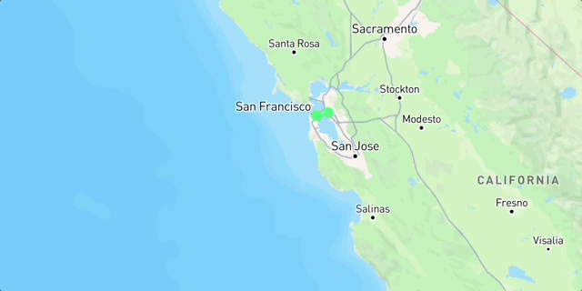
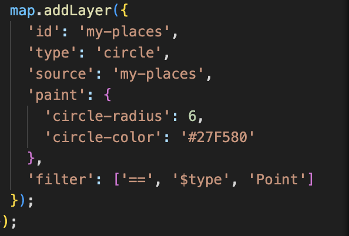

# Exploration Map
.png>)
## description

The reason i named it Exploration map is for people to utilize and influence others to use my map for the sole purpose of knowing places.
## Why did I build this?
i built this because i wanted others to see what places i explored through the bay area
Demo:

## Code Portion

This code adds a visual layer to a Mapbox map from a data source named 'my-places' that presents geographic points as styled circles. This tells the map to draw these points as solid green circles of radius 6 pixels, so they are clear and consistent in an application for displaying locations such as saved places, points of interest, or custom markers. The filter at the end makes sure only Point features of the source data are rendered, excluding any lines or polygons from being shown as circles.